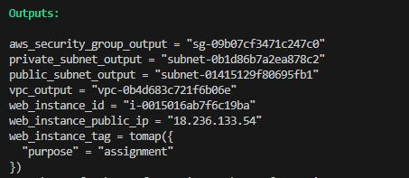

# TerraformAssignment
## Assignment 1:
#### Write a terraform script to create resources mentioned below :
1. You need to create VPC with one private subnet and one public subnet. No need to create NAT gateway.
2. You need to create an EC2 instance in the above created VPC in public subnet, instance type should be t2.micro, volume size should be 8gb and volume type should be gp2, should not be encrypted. You need to Add tag as key should be "purpose" and value should be "Assignment".
3. You need to create security group and attach it to above Ec2 instance. Security group should have inbound rules for ssh port and should have outbound rules of all traffic.

### The Output of the terraform script.
```
aws_security_group_output = "sg-09b07cf3471c247c0"
private_subnet_output = "subnet-0b1d86b7a2ea878c2"
public_subnet_output = "subnet-01415129f80695fb1" 
vpc_output = "vpc-0b4d683c721f6b06e"
web_instance_public_ip = "18.236.133.54"
web_instance_id = "i-0015016ab7f6c19ba"
web_instance_tag = tomap({
  "purpose" = "assignment"
})
```

### Screen shot of the optput.
